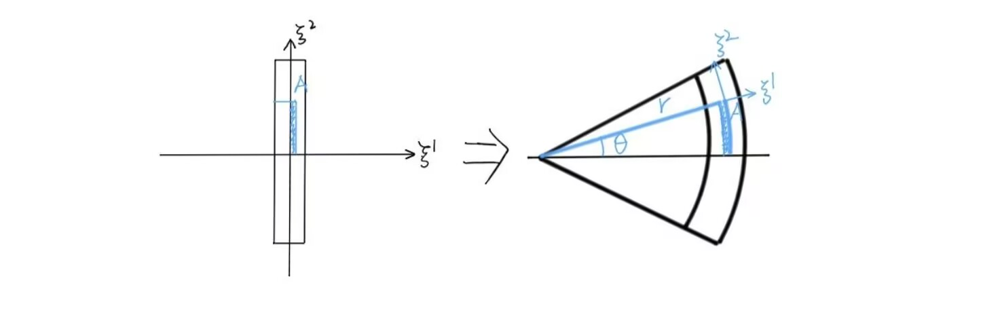

# 作业五

## 1

> 继续考虑作业一第 3 题中的平板运动，取各物质点的原始直角坐标为拉格朗日坐标 $\xi^i$ 。
> 
> (1) 沿变形前正方形板两条对角线方向的物质线的伸长因数分别是多少？请用直观的几何方法求出结果，再利用应变张量分量与伸长因数的相关公式加以验证。
> 
> (2) 请写出变形梯度张量 $\boldsymbol{F}$ 在所给直角坐标系下的分量。
> 
> (3) 求两个应变张量的主轴和主分量，说明这些主轴和主分量的物理意义。
> 
> (4) 请写出变形梯度张量 $\boldsymbol{F}$ 的极分解公式中出现的三个张量在所给直角坐标系下的分量，并解释这三个张量在描述该平板变形时的物理意义。
> 
> (5) 请利用位移矢量（已经在作业四中求出）与两个应变张量以及变形梯度张量的关系求这三个张量在所给直角坐标系下的分量。

记变形前拉格朗日坐标系的协变基矢量为 $\mathring{\boldsymbol{e}}_1 = (1, 0), \mathring{\boldsymbol{e}}_2 = (0, 1)$ 。显然有 $\mathring{\boldsymbol{e}}^i = \mathring{\boldsymbol{e}}_i \; (i = 1, 2)$

### (1)

变形前两条对角线长度均为 $\sqrt{2}$ 。变形后原来呈左上-右下走向的对角线 $A$ 长度变为 $3$ ，原来呈左下-右上走向的对角线 $B$ 长度变为 $\sqrt{5}$ 。所以沿这两条对角线方向的物质线的伸长因数分别是：

$$
l_A
= \frac{3}{\sqrt{2}} - 1
= \frac{3 \sqrt{2}}{2} - 1 \\
l_B
= \frac{\sqrt{5}}{\sqrt{2}} - 1
= \frac{\sqrt{10}}{2} - 1
$$

验证：取与变形前两条对角线同方向的单位向量 $\mathring{\boldsymbol{\alpha}}_A = \frac{1}{\sqrt{2}} \mathring{\boldsymbol{e}}^1 - \frac{1}{\sqrt{2}} \mathring{\boldsymbol{e}}^2, \mathring{\boldsymbol{\alpha}}_B = \frac{1}{\sqrt{2}} \mathring{\boldsymbol{e}}^1 + \frac{1}{\sqrt{2}} \mathring{\boldsymbol{e}}^2$ ，则：

$$
l_A
= \sqrt{1 + 2 \mathring{\boldsymbol{\alpha}}_A \cdot \mathring{\boldsymbol{\varepsilon}} \cdot \mathring{\boldsymbol{\alpha}}_A} - 1
= \frac{3 \sqrt{2}}{2} - 1
$$

$$
l_B
= \sqrt{1 + 2 \mathring{\boldsymbol{\alpha}}_B \cdot \mathring{\boldsymbol{\varepsilon}} \cdot \mathring{\boldsymbol{\alpha}}_B} - 1
= \frac{\sqrt{10}}{2} - 1
$$

### (2)

此前已求得：

$$
\boldsymbol{e}_1 = \mathring{\boldsymbol{e}}_1 - \mathring{\boldsymbol{e}}_2 \\
\boldsymbol{e}_2 = \mathring{\boldsymbol{e}}_1 + 2 \mathring{\boldsymbol{e}}_2
$$

故：

$$
\boldsymbol{F}
= \boldsymbol{e}_i \mathring{\boldsymbol{e}}^i
= \mathring{\boldsymbol{e}}_1 \mathring{\boldsymbol{e}}_1 + \mathring{\boldsymbol{e}}_1 \mathring{\boldsymbol{e}}_2 - \mathring{\boldsymbol{e}}_2 \mathring{\boldsymbol{e}}_1 + 2 \mathring{\boldsymbol{e}}_2 \mathring{\boldsymbol{e}}_2
$$

$\boldsymbol{F}$ 的分量为：

$$
\mathring{F}^{11} = 1 \\
\mathring{F}^{12} = 1 \\
\mathring{F}^{21} = -1 \\
\mathring{F}^{22} = 2
$$

### (3)

此前已求得：

$$
\varepsilon_{11} = \frac{1}{2} \quad
\varepsilon_{12} = \varepsilon_{21} = - \frac{1}{2} \quad
\varepsilon_{22} = 2
$$

下面将 $\mathring{\boldsymbol{\varepsilon}}$ 对角化。解下方程（ $\lambda$ 为实数， $\boldsymbol{\alpha} = \alpha_i \mathring{\boldsymbol{e}}^i$）：

$$
\mathring{\boldsymbol{\varepsilon}} \cdot \boldsymbol{\alpha} - \lambda \boldsymbol{\alpha} = 0
$$

$$
\Rightarrow
\begin{pmatrix}
    \varepsilon_{11} - \lambda & \varepsilon_{12} \\
    \varepsilon_{21} & \varepsilon_{22} - \lambda
\end{pmatrix}
\begin{pmatrix}
    \alpha_1 \\
    \alpha_2
\end{pmatrix}
=\begin{pmatrix}
    0 \\
    0
\end{pmatrix}
$$

得：

$$
\begin{cases}
    \lambda = \frac{5 + \sqrt{13}}{4} \\
    \begin{pmatrix}
        \alpha_1 \\
        \alpha_2
    \end{pmatrix}
    = \frac{1}{\sqrt{26 - 6 \sqrt{13}}}
    \begin{pmatrix}
        3 - \sqrt{13} \\
        2
    \end{pmatrix}
\end{cases}
\qquad
\begin{cases}
    \lambda = \frac{5 - \sqrt{13}}{4} \\
    \begin{pmatrix}
        \alpha_1 \\
        \alpha_2
    \end{pmatrix}
    = \frac{1}{\sqrt{26 + 6 \sqrt{13}}}
    \begin{pmatrix}
        3 + \sqrt{13} \\
        2
    \end{pmatrix}
\end{cases}
$$

所以取基矢量为 

$$
\mathring{\boldsymbol{f}}_1
= \frac{1}{\sqrt{26 - 6 \sqrt{13}}}[(3 - \sqrt{13}) \mathring{\boldsymbol{e}}_1 + 2 \mathring{\boldsymbol{e}}_2] \\
\mathring{\boldsymbol{f}}_2
= \frac{1}{\sqrt{26 + 6 \sqrt{13}}}[(3 + \sqrt{13}) \mathring{\boldsymbol{e}}_1 + 2 \mathring{\boldsymbol{e}}_2]
$$

则：

$$
\mathring{\boldsymbol{\varepsilon}}
= \sum_i \mathring{\varepsilon}_i \mathring{\boldsymbol{f}}_i \mathring{\boldsymbol{f}}_i
$$

$$
\mathring{\varepsilon}_1 = \frac{5 + \sqrt{13}}{4} \quad
\mathring{\varepsilon}_2 = \frac{5 - \sqrt{13}}{4}
$$

再来研究 $\boldsymbol{\varepsilon} = \varepsilon'_{ij} \mathring{\boldsymbol{e}}^i \mathring{\boldsymbol{e}}^j$ ，有：

$$
\varepsilon'_{11} = \frac{2}{9} \quad
\varepsilon'_{12} = \varepsilon'_{21} = \frac{1}{18} \quad
\varepsilon'_{22} = \frac{7}{18}
$$

同理可得：

$$
\boldsymbol{\varepsilon}
= \sum_i \varepsilon_i \boldsymbol{f}_i \boldsymbol{f}_i
$$

其中

$$
\varepsilon_1 = \frac{11 + \sqrt{13}}{36} \\
\varepsilon_2 = \frac{11 - \sqrt{13}}{36} \\
$$

$$
\boldsymbol{f}_1 = \frac{1}{\sqrt{26 - 6 \sqrt{13}}}[(- 3 + \sqrt{13}) \mathring{\boldsymbol{e}}_1 + 2 \mathring{\boldsymbol{e}}_2] \\
\boldsymbol{f}_2 = \frac{1}{\sqrt{26 + 6 \sqrt{13}}}[(3 + \sqrt{13}) \mathring{\boldsymbol{e}}_1 - 2 \mathring{\boldsymbol{e}}_2]
$$

物理意义：

局部变形可以理解为沿着 ${\mathring{\boldsymbol{\varepsilon}}}$ 主轴方向的伸缩与主坐标系整体的转动的叠加。且主轴方向的伸长因数与对应的主分量有如下关系：

$$
\mathring{\varepsilon}_i = \frac{1}{2} ((1 + l_i)^2 - 1) \\
\varepsilon_i = \frac{1}{2} (1 - \frac{1}{(1 + l_i)^2})
$$

### (4)

$$
\boldsymbol{F}
= \boldsymbol{R} \cdot \boldsymbol{U}
= \boldsymbol{V} \cdot \boldsymbol{R}
$$

其中

$$
\boldsymbol{R}
= \frac{3 \sqrt{13}}{13} \mathring{\boldsymbol{e}}_1 \mathring{\boldsymbol{e}}_1 + \frac{2 \sqrt{13}}{13} \mathring{\boldsymbol{e}}_1 \mathring{\boldsymbol{e}}_2 - \frac{2 \sqrt{13}}{13} \mathring{\boldsymbol{e}}_2 \mathring{\boldsymbol{e}}_1 + \frac{3 \sqrt{13}}{13} \mathring{\boldsymbol{e}}_2 \mathring{\boldsymbol{e}}_2
$$

$$
\boldsymbol{U}
= \frac{5 \sqrt{13}}{13} \mathring{\boldsymbol{e}}_1 \mathring{\boldsymbol{e}}_1 - \frac{\sqrt{13}}{13} \mathring{\boldsymbol{e}}_1 \mathring{\boldsymbol{e}}_2 - \frac{\sqrt{13}}{13} \mathring{\boldsymbol{e}}_2 \mathring{\boldsymbol{e}}_1 + \frac{8 \sqrt{13}}{13} \mathring{\boldsymbol{e}}_2 \mathring{\boldsymbol{e}}_2
$$

$$
\boldsymbol{V}
= \frac{5 \sqrt{13}}{13} \mathring{\boldsymbol{e}}_1 \mathring{\boldsymbol{e}}_1 + \frac{\sqrt{13}}{13} \mathring{\boldsymbol{e}}_1 \mathring{\boldsymbol{e}}_2 + \frac{\sqrt{13}}{13} \mathring{\boldsymbol{e}}_2 \mathring{\boldsymbol{e}}_1 + \frac{8 \sqrt{13}}{13} \mathring{\boldsymbol{e}}_2 \mathring{\boldsymbol{e}}_2
$$

各张量的分量如上

求法：

对于

$$
G
:=F^T F
=\begin{pmatrix}
    1 & -1 \\
    1 & 2
\end{pmatrix}
\begin{pmatrix}
    1 & 1 \\
    -1 & 2
\end{pmatrix}
=\begin{pmatrix}
    2 & -1 \\
    -1 & 5
\end{pmatrix}
$$

将其对角化，得到：

$$
P^T G P
=\begin{pmatrix}
    \frac{7 + \sqrt{13}}{2} & 0 \\
    0 & \frac{7 - \sqrt{13}}{2}
\end{pmatrix}
=\begin{pmatrix}
    \frac{1 + \sqrt{13}}{2} & 0 \\
    0 & \frac{-1 + \sqrt{13}}{2}
\end{pmatrix}^2
$$

$$
其中正交矩阵
P=\begin{pmatrix}
    \frac{-3 + \sqrt{13}}{\sqrt{26 - 6 \sqrt{13}}} & \frac{-3 - \sqrt{13}}{\sqrt{26 + 6 \sqrt{13}}} \\
    \frac{-2}{\sqrt{26 - 6 \sqrt{13}}} & \frac{-2}{\sqrt{26 + 6 \sqrt{13}}}
\end{pmatrix}
\qquad
$$

那么
 
$$
U
:= (\mathring{U}_{ij})
=P
\begin{pmatrix}
    \frac{1 + \sqrt{13}}{2} & 0 \\
    0 & \frac{-1 + \sqrt{13}}{2}
\end{pmatrix}
P^T
$$
 
$$
R
:= (\mathring{R}_{ij})
= F U^{-1}
$$

$$
V
:= (\mathring{V}_{ij})
= F R^{-1}
$$

这样就得到了三个张量的分量

> 还有一种更简单的方法：
>
> **求出转角 $\theta$**。此题中 $\theta$ 方向与 $X 轴 \to Y 轴$ 的方向相同，所以大于零。
> 
> 我们有：
>
> $$
\cos \theta
= \frac{\mathring{\boldsymbol{f}}_1 \cdot \boldsymbol{f}_1}{|\mathring{\boldsymbol{f}}_1| |\boldsymbol{f}_1|}
= \frac{\mathring{\boldsymbol{f}}_2 \cdot \boldsymbol{f}_2}{|\mathring{\boldsymbol{f}}_2| |\boldsymbol{f}_2|}
> $$
>
> $$
\Rightarrow
\cos \theta = \frac{3 \sqrt{13}}{13} \quad
\sin \theta = \frac{2 \sqrt{13}}{13}
> $$
>
> 于是可得：
> 
> $$
R
:= (\mathring{R}_{ij})
= \begin{pmatrix}
    \cos \theta & \sin \theta \\
    - \sin \theta & \cos \theta
\end{pmatrix}
= \begin{pmatrix}
    \frac{3 \sqrt{13}}{13} & \frac{2 \sqrt{13}}{13} \\
    - \frac{2 \sqrt{13}}{13} & \frac{3 \sqrt{13}}{13}
\end{pmatrix}
> $$
>
> 进而可以求出 $\boldsymbol{U}, \boldsymbol{V}$ 的分量。

物理意义：

物质的变形可以分为两步。这两步可以是先纯变形后旋转，对应的变形梯度张量分别为 $\boldsymbol{U}, \boldsymbol{R}$ ；也可以是先旋转后纯变形，对应的变形梯度张量分别为 $\boldsymbol{R}, \boldsymbol{V}$ 。

### (5)

$$
\boldsymbol{e}^1
= \frac{2}{3} \mathring{\boldsymbol{e}}_1 - \frac{1}{3} \mathring{\boldsymbol{e}}_2
= (\frac{2}{3}, - \frac{1}{3})
\quad
\boldsymbol{e}^2
= \frac{1}{3} \mathring{\boldsymbol{e}}_1 + \frac{1}{3} \mathring{\boldsymbol{e}}_2
= (\frac{1}{3}, \frac{1}{3})
$$

$$
\boldsymbol{w}
= (1 + \xi^2) \mathring{\boldsymbol{e}}_1 + (1 - \xi^1 + \xi^2) \mathring{\boldsymbol{e}}_2
= (\frac{1}{3} \xi^1 + \frac{1}{3} \xi^2 + \frac{1}{3}) \boldsymbol{e}_1 + (- \frac{1}{3} \xi^1 + \frac{2}{3} \xi^2 + \frac{2}{3}) \boldsymbol{e}_2
$$

$$
\Rightarrow
\mathring{\nabla} \boldsymbol{w}
= \mathring{\boldsymbol{e}}^i \frac{\partial \boldsymbol{w}}{\partial \xi^i}
= - \mathring{\boldsymbol{e}}_1 \mathring{\boldsymbol{e}}_2 + \mathring{\boldsymbol{e}}_2 \mathring{\boldsymbol{e}}_1 + \mathring{\boldsymbol{e}}_2 \mathring{\boldsymbol{e}}_2
$$

$$
\nabla \boldsymbol{w}
= \boldsymbol{e}^i \frac{\partial \boldsymbol{w}}{\partial \xi^i}
= \frac{\mathring{\boldsymbol{e}}_1 \mathring{\boldsymbol{e}}_1 - \mathring{\boldsymbol{e}}_1 \mathring{\boldsymbol{e}}_2 + \mathring{\boldsymbol{e}}_2 \mathring{\boldsymbol{e}}_1 + 2 \mathring{\boldsymbol{e}}_2 \mathring{\boldsymbol{e}}_2}{3}
$$

> 上面有两个式子应修改为：
>
> $$
\boldsymbol{w}
= \dots
= (\frac{1}{3} x^1 + \frac{1}{3} x^2 + \frac{1}{3}) \boldsymbol{e}_1 + (- \frac{1}{3} x^1 + \frac{2}{3} x^2 + \frac{2}{3}) \boldsymbol{e}_2
> $$
>
> $$
\nabla \boldsymbol{w}
= \boldsymbol{e}^i \frac{\partial \boldsymbol{w}}{\partial x^i}
= \frac{\mathring{\boldsymbol{e}}_1 \mathring{\boldsymbol{e}}_1 - \mathring{\boldsymbol{e}}_1 \mathring{\boldsymbol{e}}_2 + \mathring{\boldsymbol{e}}_2 \mathring{\boldsymbol{e}}_1 + 2 \mathring{\boldsymbol{e}}_2 \mathring{\boldsymbol{e}}_2}{3}
> $$

故：

$$
\mathring{\boldsymbol{\varepsilon}}
= \frac{1}{2} (\mathring{\nabla} \boldsymbol{w} + (\mathring{\nabla} \boldsymbol{w})^T + \mathring{\nabla} \boldsymbol{w} \cdot (\mathring{\nabla} \boldsymbol{w})^T)
= \frac{1}{2} \mathring{\boldsymbol{e}}_1 \mathring{\boldsymbol{e}}_1 - \frac{1}{2} \mathring{\boldsymbol{e}}_1 \mathring{\boldsymbol{e}}_2 - \frac{1}{2} \mathring{\boldsymbol{e}}_2 \mathring{\boldsymbol{e}}_1 + 2 \mathring{\boldsymbol{e}}_2 \mathring{\boldsymbol{e}}_2
$$

$$
\boldsymbol{\varepsilon}
= \frac{1}{2} (\nabla \boldsymbol{w} + (\nabla \boldsymbol{w})^T - \nabla \boldsymbol{w} \cdot (\nabla \boldsymbol{w})^T)
= \frac{2}{9} \mathring{\boldsymbol{e}}_1 \mathring{\boldsymbol{e}}_1 + \frac{1}{18} \mathring{\boldsymbol{e}}_1 \mathring{\boldsymbol{e}}_2 + \frac{1}{18} \mathring{\boldsymbol{e}}_2 \mathring{\boldsymbol{e}}_1 + \frac{7}{18} \mathring{\boldsymbol{e}}_2 \mathring{\boldsymbol{e}}_2
$$

$$
\boldsymbol{F}
= \boldsymbol{g} + (\mathring{\nabla} \boldsymbol{w})^T
= \mathring{\boldsymbol{e}}_1 \mathring{\boldsymbol{e}}_1 + \mathring{\boldsymbol{e}}_1 \mathring{\boldsymbol{e}}_2 - \mathring{\boldsymbol{e}}_2 \mathring{\boldsymbol{e}}_1 + 2 \mathring{\boldsymbol{e}}_2 \mathring{\boldsymbol{e}}_2
$$

## 2

> 设单位直径、单位高度的均质圆柱体发生了微小扭转，其底面保持原位，而顶面扭转角为 $\alpha$ 。请自主选取最方便的坐标系来定义拉格朗日坐标，在合理假设下用直观几何方法分析相应线段的长度变化和夹角变化，从而利用相应物理意义直接写出应变张量在随体坐标系下的协变分量（不要通过求随体坐标系基矢量的常规方法计算）。

取如下~~的~~柱 `面` 坐标系 ($\xi^1 = r, \xi^2 = \theta, \xi^3 = z$) 为变形前的拉格朗日坐标系：坐标系的原点与底面圆心重合， $\xi^3$ 轴与柱体中轴指向相同。

对于柱体中某个平行于底面的物质面，认为其内部各点与轴线的距离不变，~~其~~与底面的距离不变，其扭转的角度正比于与底面的距离。

那么在某一物质点处， $\xi^1$ 坐标线仍是直线，没有~~经过~~伸缩，绕中轴旋转了角度 $\xi^3 \alpha$ ； $\xi^2$ 坐标线仍是圆，半径不变，绕中轴旋转了角度 $\xi^3 \alpha$ ； $\xi^3$ 坐标线变为曲线（若将侧面展开铺成长方形，则此坐标线呈斜线形状），在此物质点处~~其切线~~与变形前 $\xi^3$ 坐标线的夹角为 $\alpha$ `错误`。于是：

> 变形前后 $\xi^3$ 坐标线的夹角实为 $\xi^1 \alpha$

$$
l_i = 0 \quad (i = 1, 2) \\
\cancel{l_3 = \sqrt{1 + \frac{\alpha^2}{4}} - 1 = 0 \quad (一阶近似)}
$$

> $$
l_3 = \sqrt{1 + \frac{(\xi^1 \alpha)^2}{4}} - 1 = 0 \quad (一阶近似)
> $$

$$
\varphi_{12} = \frac{\pi}{2} \\
\cancel{\varphi_{23} = \frac{\pi}{2} - \alpha} \\
\varphi_{13} = \frac{\pi}{2}
$$

> $$
\varphi_{23} = \frac{\pi}{2} - \xi^1 \alpha
> $$

所以：

$$
\varepsilon_{ii}
= \frac{1}{2} |\mathring{\boldsymbol{e}}_i|^2 ((1 + l_i)^2 - 1)
= 0
$$

$$
\varepsilon_{ij}
= \frac{1}{2} |\boldsymbol{e}_i| |\boldsymbol{e}_j| \sin (\frac{\pi}{2} - \varphi_{ij})
= \frac{1}{2} |\mathring{\boldsymbol{e}}_i| |\mathring{\boldsymbol{e}}_j| \sin (\frac{\pi}{2} - \varphi_{ij}) \quad (一阶近似) \\
=\begin{cases}
    0 & (i = 1, j = 2 或 i = 1, j = 3)\\
    \frac{\xi^1}{2} (\frac{\pi}{2} - \varphi_{23}) & (i = 2, j = 3)
\end{cases}
$$

综上：

$$
\cancel{\varepsilon_{ij} =
\begin{cases}
    \frac{1}{2} \xi^1 \alpha & (i = 2, j = 3 或 i = 3, j = 2) \\
    0 & (其他情况)
\end{cases}}
$$

> $$
\varepsilon_{ij} =
\begin{cases}
    \frac{1}{2} (\xi^1)^2 \alpha & (i = 2, j = 3 或 i = 3, j = 2) \\
    0 & (其他情况)
\end{cases}
> $$

## 3

> 设长度和厚度分别为 $20cm$ 和 $2mm$ 的有机玻璃直尺被手指掰为圆弧形状。其曲率半径为 $50cm$ （尺子两面的曲率半径有微小差别，以平均值计算）。请自主选取最方便的坐标系来定义拉格朗日坐标，在合理假设下用直观几何方法分析相应线段的长度变化和夹角变化，从而利用相应物理意义直接写出应变张量在随体坐标系下的协变分量（不要通过求随体坐标系基矢量的常规方法计算）。

记 $l = 10 cm, d = 1 mm, R = 50 cm$ 。

取如上的笛卡尔直角坐标系为变形前的拉格朗日坐标系：坐标系是右手系，原点位于直尺的中心， $\xi^1$ 坐标轴平行于厚度方向， $\xi^2$ 坐标轴平行于长度方向。显然对于直尺内部， $-d \leq \xi^1 \leq d$ ， $-l \leq \xi^2 \leq l$ 。

认为对于任意物质点 $A$ ，蓝色部分的体积不变，那么：

`错误，这个假设其实不成立`

`对于流体一般可以引入不可压缩假设，但是固体不可以。固体的变形本身就说明了其可压缩的性质。`

$$
\xi^1 \xi^2
= \frac{1}{2} \theta (r^2 - R^2)
$$

再假设

$$
\frac{\xi^2}{l}
= \frac{\theta}{\theta_0}
= \frac{\theta R}{l} \\
$$

$$
\Rightarrow
\begin{cases}
    \theta = \frac{\xi^2}{R} \\
    r = \sqrt{R^2 + 2 R \xi^1}
\end{cases}
$$

于是可以得到， $A$ 点处：

$$
l_1
= |\frac{d r}{d \xi^1}| - 1
= \frac{R}{\sqrt{R^2 + 2 R \xi^1}} - 1
$$

$$
l_2
= |r \frac{d \theta}{d \xi^2}| - 1
= \frac{\sqrt{R^2 + 2 R \xi^1}}{R} - 1
$$

$$
l_3 = 0
$$

变形后随体坐标系依然是正交的，所以：

$$
\varphi_{ij} = \frac{\pi}{2} \quad (i \neq j)
$$

于是：

$$
\varepsilon_{ii}
= \frac{1}{2} |\mathring{\boldsymbol{e}}_i|^2 ((1 + l_i)^2 - 1)
=\begin{cases}
    - \frac{\xi^1}{R + 2 \xi^1} & (i = 1) \\
    \frac{\xi^1}{R} & (i = 2) \\
    0 & (i = 3)
\end{cases}
$$

$$
\varepsilon_{ij}
= \frac{1}{2} |\boldsymbol{e}_i| |\boldsymbol{e}_j| \sin (\frac{\pi}{2} - \varphi_{ij})
= 0
\quad
(i \neq j)
$$

综上：

$$
\varepsilon_{ij}
=\begin{cases}
    - \frac{\xi^1}{R + 2 \xi^1} & (i = j = 1) \\
    \frac{\xi^1}{R} & (i = j = 2) \\
    0 & (其他情况)
\end{cases}
$$

`此结果在定性上是合理的，但在定量上不对`

> 一种可行的思路：
>
> 认为过 $\xi^1 = 0$ 点的 $\xi^2$ 坐标线在直尺内的部分长度不变，仍为 $2 \theta_0 R = 2 l$ 。对任意的 $\xi^2$ 坐标线，其在直尺内部分的长度为：
>  
> $$
l'
= 2 \theta_0 (R + \xi^1)
= 2 l (1 + \frac{\xi^1}{R})
> $$
>
> 那么：
> 
> $$
l_1
= \frac{l'}{2 l} - 1
= \frac{\xi^1}{R}
> $$
> 
> $$
l_2
= - \gamma l_1
= - \frac{\gamma \xi^1}{R}
> $$
>
> 其中 $\gamma$ 为材料的泊松比
>
> 其他类似上面的过程，最终得到：
> 
> $$
\varepsilon_{ij}
=\begin{cases}
    \frac{\xi^1}{R} & (i = j = 1) \\
    - \frac{\gamma \xi^1}{R} & (i = j = 2) \\
    0 & (其他情况)
\end{cases}
> $$